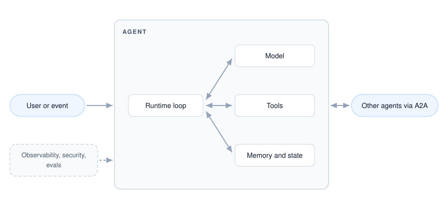
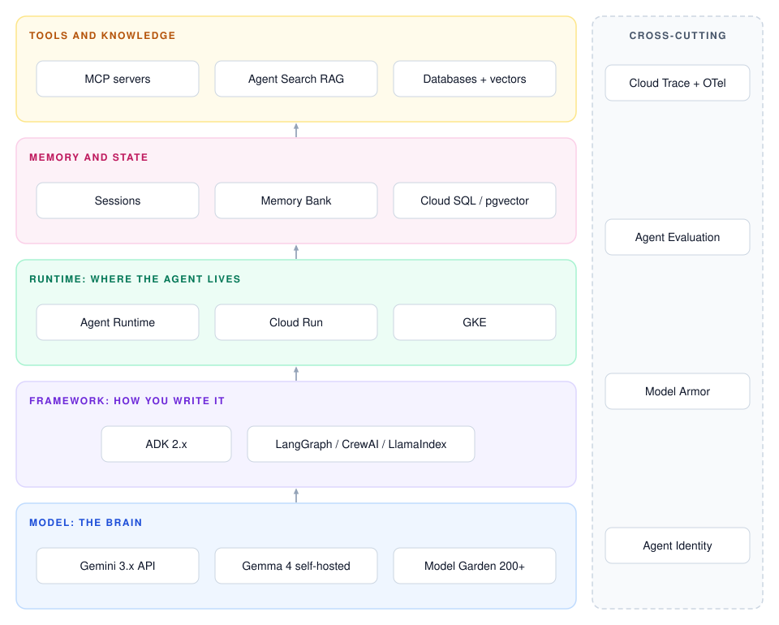
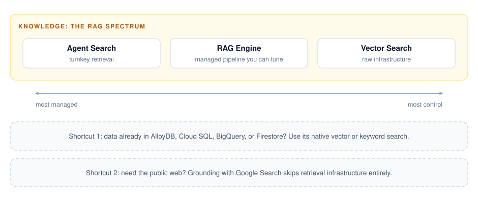
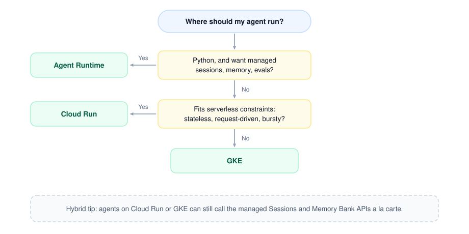

# The anatomy of an AI agent on Google Cloud: a complete guide

You built an agent. It works on your laptop: a model, a loop, a few tools. Now you want it in production on Google Cloud, and suddenly you're staring at a wall of product names: ADK, Agent Runtime, Cloud Run, GKE, Gemini Enterprise Agent Platform. This post is a map of that landscape and a way to think about it: every layer of the stack, what Google offers at each one, and how to decide. Product names are current as of this writing, with former names in parentheses where the [Next '26 consolidation](https://cloud.google.com/blog/topics/google-cloud-next/google-cloud-next-2026-wrap-up) renamed things.

## The anatomy of an agent

Strip away the frameworks and every agent is the same five parts: a **model** that reasons, **tools** it can call, **memory** so it isn't goldfish-brained, a **runtime loop** that ties them together until the task is done, and increasingly **connections to other agents**. Everything Google Cloud offers fills one of these slots, plus the cross-cutting production concerns (observability, security, evaluation) that apply to all of them.

## The stack, layer by layer

### The model: Gemini, Claude, or open weights

A typical brain is **Gemini 3.x** via the API: Gemini 3.1 Pro for hard reasoning, the Flash tier as the cost-effective workhorse many agents actually need. And it isn't Gemini-only: [Model Garden](https://docs.cloud.google.com/gemini-enterprise-agent-platform/models/model-garden/explore-models) offers 200+ models inside your Google Cloud project, including Anthropic's Claude and open-weights leaders like GLM, Kimi, and DeepSeek, many as pay-per-token services. To compare candidate brains on agentic work, [Agent Arena](https://arena.ai/leaderboard/agent) ranks models on tool orchestration and task completion across a million-plus real agent sessions.

Self-hosting an open-weights model is also practical now. [Gemma 4](https://blog.google/innovation-and-ai/technology/developers-tools/gemma-4/) ships with function calling and structured output, and [Cloud Run GPUs](https://docs.cloud.google.com/run/docs/configuring/services/gpu) serve it with scale-to-zero economics: both NVIDIA L4 GPUs (24 GB, fits small and mid-size models) and 96 GB NVIDIA RTX PRO 6000 Blackwell GPUs for 70B-class models are generally available, with no quota request needed for the L4s ([Run Gemma on Cloud Run](https://docs.cloud.google.com/run/docs/run-gemma-on-cloud-run) walks through the pattern with the vLLM inference engine). But for low-traffic agents, pay-per-token Flash is often cheaper than keeping a GPU warm (run the numbers for your own traffic: [Gemini pricing](https://cloud.google.com/gemini-enterprise-agent-platform/generative-ai/pricing) vs [Cloud Run pricing](https://cloud.google.com/run/pricing)); self-hosting wins on data control, fine-tuning freedom, and high sustained utilization.

### The framework: ADK first, but not ADK only

[Agent Development Kit (ADK)](https://adk.dev/) is Google's open-source, code-first framework (Python, Go, Java, TypeScript, Kotlin); [ADK 2.0](https://adk.dev/2.0/) moved it to a graph-based execution engine with parallel workflows, automatic retries, and human-in-the-loop pauses. It's the framework the rest of the stack is tuned for: one command deploys to Agent Runtime or Cloud Run, with evals and tracing included. It's not the only option, though: Agent Runtime also supports [LangGraph, LangChain, LlamaIndex, and AG2](https://docs.cloud.google.com/gemini-enterprise-agent-platform/build/runtime), anything containerized runs on Cloud Run, and ADK itself drives non-Google models via LiteLLM.

### The runtime: where the agent lives

[Agent Runtime](https://docs.cloud.google.com/gemini-enterprise-agent-platform/build/runtime) is the "managed everything" option: hand it framework-native code and get sessions, memory, sandboxed code execution, and observability without building any of it. [Cloud Run](https://cloud.google.com/run) runs your agent as a standard container and is a popular community choice, covering chat backends, [worker pools](https://cloud.google.com/blog/products/serverless/whats-new-for-cloud-run-at-next26) for queue-driven agents, jobs for batch runs up to 7 days, and GPU serving. [GKE](https://cloud.google.com/blog/products/containers-kubernetes/agentic-ai-on-kubernetes-and-gke) carries the most operational complexity and makes sense when you're running a fleet of agents or self-hosting models.

And these compose: Sessions and Memory Bank are [callable a la carte](https://docs.cloud.google.com/gemini-enterprise-agent-platform/scale/sessions) from an agent on Cloud Run or GKE, so pick where the agent runs and borrow managed services as needed.

| | Agent Runtime (formerly Vertex AI Agent Engine) | Cloud Run | GKE |
|---|---|---|---|
| What it is | Managed agent runtime | Serverless containers | Managed Kubernetes |
| You bring | Python agent code | Any container | Containers + Kubernetes config |
| Manages for you | Sessions, Memory Bank, code sandbox, tracing, evals | Autoscaling (to zero), TLS, versioned deploys | The core of the cluster (all of it in Autopilot mode) |
| Best for | Fastest path to managed production state | Most agents, MCP/A2A servers, GPU serving | Multi-agent platforms, self-hosted LLMs |

### Tools and knowledge: MCP, A2A, and the RAG spectrum

Agent tools are converging on **MCP**: Google runs [managed MCP servers](https://cloud.google.com/blog/products/databases/managed-mcp-servers-for-google-cloud-databases) for its databases and services, the open-source [MCP Toolbox](https://github.com/googleapis/mcp-toolbox) covers 40+ data sources, and [Cloud Run hosts custom MCP servers](https://docs.cloud.google.com/run/docs/host-mcp-servers). Agent-to-agent coordination has its own protocol, [A2A](https://a2a-protocol.org/): MCP connects an agent to its tools, A2A connects agents to each other.

For knowledge, think in a spectrum of abstraction: [Agent Search](https://docs.cloud.google.com/generative-ai-app-builder/docs) (formerly Vertex AI Search) is turnkey retrieval, [RAG Engine](https://docs.cloud.google.com/gemini-enterprise-agent-platform/build/rag-engine/rag-overview) is a managed pipeline you can tune, [Vector Search](https://docs.cloud.google.com/gemini-enterprise-agent-platform/build/vector-search/overview) is raw infrastructure. Apply the data-location test first: if your data already lives in [AlloyDB](https://docs.cloud.google.com/alloydb/docs/ai/what-is-alloydb-ai), Cloud SQL, [BigQuery](https://docs.cloud.google.com/bigquery/docs/vector-search-intro), or Firestore, use that database's native vector or keyword search instead of moving data. And if the knowledge you need is the public web, [grounding with Google Search](https://docs.cloud.google.com/gemini-enterprise-agent-platform/models/grounding/grounding-with-google-search) skips retrieval infrastructure entirely.

### State and memory: the scratchpad and long-term memory

The key distinction: **session state** (the scratchpad of the current conversation) versus **memory** (distilled facts that survive across sessions). For session state, ADK offers [three backends](https://adk.dev/sessions/session/): in-memory for dev, your own Postgres, or Agent Runtime's managed Sessions service. For long-term memory, [Memory Bank](https://docs.cloud.google.com/gemini-enterprise-agent-platform/scale/memory-bank) uses generative AI to extract and consolidate facts about each user rather than stuffing transcripts into a vector store. Memory Bank isn't required, though: ADK's [memory interface](https://adk.dev/sessions/memory/) is pluggable, so you can back it with your own store, and vector search in your own database is also an option for long-term recall.
### Cross-cutting: production is the hard part

Three of the biggest gaps between a demo and a production agent: **Observability**: ADK emits OpenTelemetry traces per the GenAI semantic conventions, and [Cloud Trace renders](https://docs.cloud.google.com/stackdriver/docs/observability/agent-observability) every model and tool call as an inspectable span. **Evaluation**: [`adk eval`](https://adk.dev/evaluate/) scores tool-call trajectories, not just final answers, and [Agent Evaluation and Simulation](https://docs.cloud.google.com/gemini-enterprise-agent-platform/optimize/evaluation/agent-evaluation) run synthetic users and continuous scoring on live traffic. **Security**: least-privilege service accounts (or [Agent Identity](https://docs.cloud.google.com/iam/docs/agent-identity-overview), the new IAM principal type built for agents), [Model Armor](https://docs.cloud.google.com/model-armor/overview) screening prompts and responses, and [human confirmation](https://adk.dev/tools-custom/confirmation/) on destructive tools.

## The decision guide

The shortest honest version: start on Cloud Run with ADK, adopt Agent Runtime when managed sessions, memory, and evals are worth a platform-specific API, and graduate to GKE when you're running a fleet, not an agent.

## A reference architecture for the common case

For a typical production agent with tools, memory, and real users, a solid setup might look like: **ADK on Cloud Run** fronted by your existing auth; **Gemini Flash** by default with Pro for escalation; tools via **MCP**; **Cloud SQL** for session state and **Memory Bank** for long-term memory; traces into **Cloud Trace**; `adk eval` in CI via [agents-cli](https://github.com/google/agents-cli), which scaffolds exactly this setup with Terraform and a staging-then-prod pipeline. Every piece is swappable, which is the point of picking the container path first.

## Where this is heading

The building blocks above are stable enough to bet on. To go deeper, the [Agent Factory podcast](https://www.youtube.com/playlist?list=PLIivdWyY5sqLXR1eSkiM5bE6pFlXC-OSs) from Google's DevRel team covers most of these layers episode by episode, and [adk-samples](https://github.com/google/adk-samples) plus the [codelabs](https://codelabs.developers.google.com/your-first-agent-with-adk) are the fastest way from map to working code.
