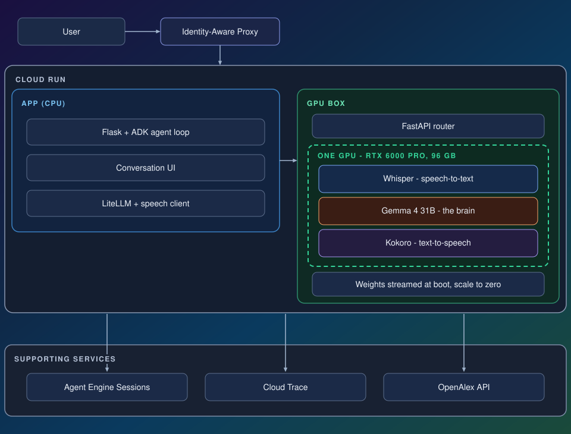
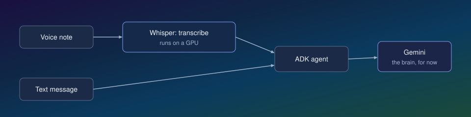
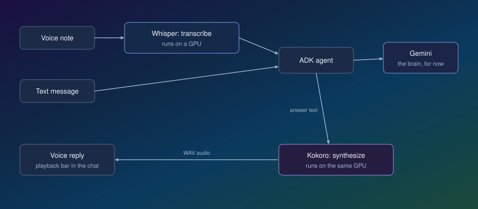
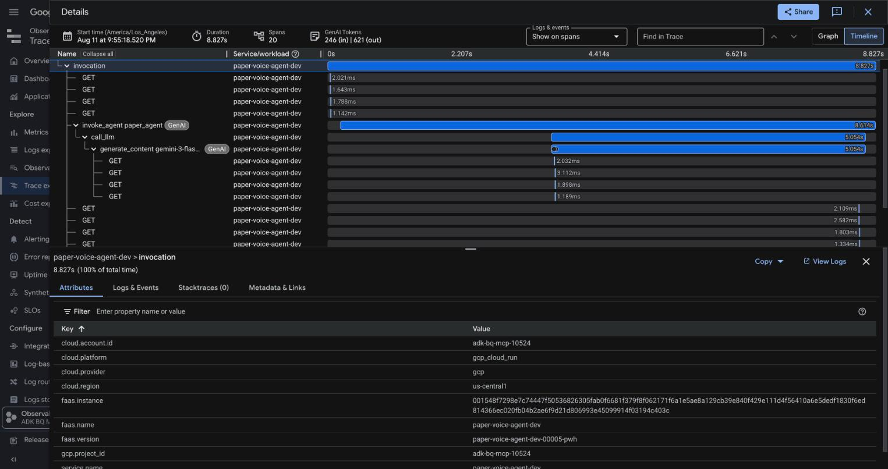

# From prototype to production: a self-hosted voice agent on a single Cloud Run GPU

What is it actually like to build an AI agent with open-weights models?

In this article I'll show you how I built a voice agent that answers questions about scientific papers. You ask a question by text or voice, it searches and fetches papers, and the answer comes back as text and voice. Three open-weights models run the whole thing on a single GPU on Google Cloud: **Whisper** for speech-to-text, **Gemma 4 31B** as the brain, and **Kokoro** for text-to-speech.

My goal with this post is to give you an end-to-end intuition of what it actually takes to build a system like this. Note that you can swap in any data source you want, public or private, for the paper search.

## Why open weights

There are a few reasons why you might want to use open-weights models.

First, total control. You can host the model anywhere you want: locally if you have a big enough GPU, or on any infrastructure you choose, and you can swap it anytime in the future. There's also the option to fine-tune it for your specific use case. And from a cost perspective, it can be cheaper if you have high-volume sustained traffic.

Another nice benefit is that you can potentially put multiple models on a single GPU. In this particular case:

| Model | Role | VRAM |
|---|---|---|
| Gemma 4 31B (fp8) | brain: reasoning + tool calls | ~30 GB + KV cache |
| Whisper large-v3-turbo | ears: speech-to-text | ~2 GB |
| Kokoro 82M | mouth: text-to-speech | under 1 GB |

One RTX 6000 Pro has 96 GB, so the whole stack shares a single GPU. You get charged per hour for each GPU you use. So by putting all three models on a single GPU, you only get charged for one instead of three separate ones.

## Screenshot & demo


[Demo video](https://github.com/user-attachments/assets/ccdd3cf1-fd42-4b0a-8827-dd51140f795f)

## The architecture



It's two Cloud Run services that talk to each other:

- **The app** (CPU, small): the chat page, the ADK agent loop, and a way to securely communicate with the GPU box.
- **The GPU box**: a FastAPI router owning the exposed port, two vLLM processes behind it (Whisper and Gemma on localhost ports), Kokoro inside the router. Gemma's weights stream from a public GCS bucket at boot. The small models are baked into the image.

I decided to separate this into two services instead of shoving everything into one box so that it's faster to iterate over the frontend application.

## How I built it, step by step

### Step 1: verify a GPU container runs on Cloud Run

When I first tried to build this a few weeks earlier, I had trouble getting GPU quota in my Google Cloud account. So before building anything real, I wanted to clear that basic hurdle: get any Cloud Run container running with a GPU. I wrote [`hello-gpu/`](gemma-voice-agent-code/hello-gpu), an HTTP server whose only job is to run `nvidia-smi` and return its output. `nvidia-smi` is NVIDIA's command-line tool that reports the GPUs the driver can see. I deployed it with one command:

```sh
gcloud run deploy hello-gpu \
  --source . \
  --region us-central1 \
  --gpu 1 --gpu-type nvidia-l4 --no-gpu-zonal-redundancy \
  --cpu 4 --memory 16Gi \
  --max-instances 1 \
  --allow-unauthenticated
```

That's a full GPU service from a source folder: Cloud Run builds the container, attaches one L4 GPU, and gives you a URL. Curling it returned the `nvidia-smi` table with the L4 in it, which confirms the driver sees a real GPU. The L4 is the smaller of the two GPU types Cloud Run offers, with 24 GB of memory. The real stack later runs on the bigger one, the 96 GB RTX 6000 Pro.

### Step 2: build the chat app and the agent loop

Then I built the app ([`app/`](gemma-voice-agent-code/app)): a chat page backed by an ADK agent with two tools I wrote, *search papers* and *fetch one paper* ([`app/tools.py`](gemma-voice-agent-code/app/tools.py)). I wrote them using the OpenAlex API, a free public index of academic papers. The whole agent is this:

```python
_agent = Agent(
    name="paper_agent",
    model=MODEL_ID,   # a hosted Gemini model at this point
    instruction=SYSTEM_PROMPT,
    tools=[tools.search_papers, tools.get_paper],
)
```

An agent in ADK is exactly those four things: a name, a model, a system prompt telling it to ground answers in real papers and cite them, and a list of tools.

The tools are plain Python functions. ADK reads their signatures and docstrings, presents them to the model as callable tools, runs whichever ones the model asks for, and feeds the results back.

The model at this point was a hosted Gemini model: good for quick testing while the rest of the system took shape.

### Step 3: build the transcription path

For voice input, I built a transcription step into the chat endpoint. When a voice note arrives, this is what happens to it:

```python
if audio:
    transcript = speech_client.transcribe(audio, audio_mime)
    yield json.dumps({"type": "transcript", "text": transcript}) + "\n"
    message = f"{text}\n{transcript}" if text else transcript
```

The pipeline: audio goes to Whisper, the transcript comes back as text, and that text becomes the message the agent receives ([full file](gemma-voice-agent-code/app/server.py)).

Whisper itself runs on the GPU: vLLM can serve Whisper large-v3-turbo. The app just posts the audio to it and gets JSON back ([client code](gemma-voice-agent-code/app/speech_client.py)).

The transcript is also shown in the UI: it fills your chat bubble, so you see what the system heard.



### Step 4: build the text-to-speech path

The reply makes the same trip in reverse: once the answer has streamed in as text, the app sends it to Kokoro and gets audio back. This is the code that turns the text into speech, running on the GPU box:

```python
def _kokoro_pipeline():
    global _kokoro
    if _kokoro is None:
        from kokoro import KPipeline

        _kokoro = KPipeline(lang_code="a")  # American English
    return _kokoro

voice = body.get("voice") or os.environ.get("KOKORO_VOICE", "af_heart")
pipeline = _kokoro_pipeline()
chunks = []
for _, _, audio in pipeline(text, voice=voice):
    chunks.append(audio.numpy() if hasattr(audio, "numpy") else np.asarray(audio))
```

The pipeline: answer text goes in, Kokoro turns it into audio chunk by chunk, and the chunks are joined and returned as a WAV file. The helper at the top loads the model once, on first use, and every request after that reuses the same loaded pipeline ([full file](gemma-voice-agent-code/gpu-speech/server.py)).

In the UI, each reply gets a playback bar, and the voice is generated on demand when the answer arrives.



### Step 5: self-host the models

I put all three models in the GPU box ([`gpu-speech/`](gemma-voice-agent-code/gpu-speech)) and swapped the interim Gemini brain for self-hosted Gemma. ADK allows you to make the swap in a few lines of code. The `model=MODEL_ID` from step 2 became:

```python
LiteLlm(
    model=f"openai/{MODEL_ID}",
    base_url=MODEL_API_BASE + "/v1",   # the GPU box
    api_key=_fetch_identity_token(),   # refreshed before each turn
    extra_body={
        "chat_template_kwargs": {"enable_thinking": True},
        "skip_special_tokens": False,
    },
)
```

That object goes straight into the agent's `model` field, and nothing else about the agent changes:

```python
_agent = Agent(
    name="paper_agent",
    model=_self_hosted_model(),   # returns the LiteLlm above
    instruction=SYSTEM_PROMPT,
    tools=[tools.search_papers, tools.get_paper],
)
```

This tells the agent three things:

- Where the brain lives: the GPU box's URL, which vLLM exposes as an OpenAI-compatible endpoint.
- How to prove it's allowed in: a Google-signed identity token instead of an API key, because the box rejects anonymous callers.
- To run Gemma with thinking mode on ([full file](gemma-voice-agent-code/app/model.py)).

Tool calling works because vLLM ships a parser for Gemma's tool-call format (`--tool-call-parser gemma4`) ([launch script](gemma-voice-agent-code/gpu-speech/start.sh)).

### Step 6: add sign-in and make conversations persistent

I put Google sign-in in front of the service with Identity-Aware Proxy, Google Cloud's built-in sign-in layer. The app turns each signed-in request into a stable user ID:

```python
def _user_id() -> str:
    assertion = request.headers.get("X-Goog-IAP-JWT-Assertion")
    claims = g_id_token.verify_token(
        assertion,
        ga_requests.Request(),
        audience=audience,
        certs_url="https://www.gstatic.com/iap/verify/public_key",
    )
    if claims.get("iss") != "https://cloud.google.com/iap":
        raise PermissionError("bad IAP issuer")
    return claims["sub"].replace(":", "_")
```

The function checks the token's signature and extracts a stable user ID. That ID carries no email or other personal information, and it's the only identity data the app stores: conversations are keyed on it, so each person only ever sees their own ([full file](gemma-voice-agent-code/app/server.py)).

For storage, ADK's session service is swappable in a line. I pointed mine at [Agent Engine Sessions](https://docs.cloud.google.com/gemini-enterprise-agent-platform/scale/sessions), used purely as a session store:

```python
_sessions = VertexAiSessionService(
    project=os.environ.get("GOOGLE_CLOUD_PROJECT"),
    location=os.environ.get("SESSION_LOCATION", "us-central1"),
    agent_engine_id=AGENT_ENGINE_ID,
)
_runner = Runner(app=_app, session_service=_sessions)
```

That's the entire storage change: same agent, same runner, but every message and tool result now lands in a managed store. It survives restarts and is reachable from any instance, instead of living in process memory ([full file](gemma-voice-agent-code/app/model.py)).

On top of it I built a standard conversation UI: a drawer that lists conversations, plus switch, rename, and delete.

### Step 7: prototype to production

At that point I had a pretty solid working prototype, but I wanted to take a few steps to bring it closer to production.

#### Error recovery

I enabled ADK's resumability, so a turn that dies midway resumes from its last persisted event, whether that's a tool call, a tool result, or the message itself, instead of the user retyping it:

```python
_app = App(
    name=APP_NAME,
    root_agent=_agent,
    resumability_config=ResumabilityConfig(is_resumable=True),
)
```

That flag does the heavy lifting ([full file](gemma-voice-agent-code/app/model.py)). To make it work, the app has a retry endpoint and a Retry button on the failed turn.

#### Observability



ADK instruments the agent loop with OpenTelemetry natively. Every turn produces a trace like the one above. Each bar is a span, one timed step of the turn: a model call, a tool call, and the agent run that contains them, with token counts attached. All I had to add was export wiring - a few packages and a few lines that install a Cloud Trace exporter using ADK's own helpers:

```python
import google.auth
from google.adk.telemetry.google_cloud import get_gcp_exporters, get_gcp_resource
from google.adk.telemetry.setup import maybe_set_otel_providers

credentials, project = google.auth.default()  # the identity the service runs as
maybe_set_otel_providers(  # install as the app's OpenTelemetry provider
    otel_hooks_to_setup=[
        get_gcp_exporters(  # exports spans to Cloud Trace
            enable_cloud_tracing=True, google_auth=(credentials, project)
        )
    ],
    otel_resource=get_gcp_resource(project),
)
```

The helpers come from ADK's telemetry modules, as the imports show. `google.auth.default()` returns the identity the service runs as: every Cloud Run service has its own Google Cloud identity. The helpers build a Cloud Trace exporter authorized as that identity and install it as the app's OpenTelemetry provider. From then on, every span ADK emits is sent to Cloud Trace automatically. There's nothing per-turn to write ([full file](gemma-voice-agent-code/app/telemetry.py)).

#### Evals

I wrote six eval cases ([`eval/`](gemma-voice-agent-code/eval)) in three groups: questions that must call the search tool, questions that must not (a greeting shouldn't trigger a search), and an ambiguous one that should ask for clarification. Each case's reference is a rubric scored by an LLM judge, because judges survive rephrasing and exact-match metrics don't. The judge is test infrastructure, not part of the product.

#### Open it to real users

The first real user found a real bug within hours: when the paper search failed upstream, the tool caught its own exceptions, apologized politely, and logged nothing. The failure was invisible everywhere except the user's screen. The fix was twofold. The likely cause was rate limiting, so I changed how the app calls the OpenAlex API: requests now carry a contact email, which OpenAlex rewards with a much higher rate limit. And whether or not that was the right diagnosis, I made sure similar failures can't hide again. Now failed attempts log their exact exceptions, and the tool marks the degradation on its own trace span, so traces show red even when the user saw a polite reply.

## A temporary performance issue and its lessons

The one slow part of this stack turned out to be session storage: while building the app, I measured session operations taking seconds each, with the first session creation in a process at 15 seconds or more. Session I/O, not the GPU, was where the time went.

The mitigation: when you open a new conversation, the app creates its session in the background while you type your first message. Starting a conversation went from seconds of waiting to feeling instant.

Afterwards, I tried my best to reproduce the issue with a set of controlled benchmarks ([tests](gemma-voice-agent-code/test)). This time, the latency was at most a few seconds, depending on the locations of the services. So it seems it was a temporary issue affecting the backend service at that point in time.


Through this set of tests, though, I realized the importance of colocation: from a container in the same region as the backends, every operation measured sub-second, while the same calls took seconds from another continent or from my laptop. Each session operation crosses the network, so the distance shows up in every turn.

You can also try different backend options, like Cloud SQL and Agent Engine, to see what works best for you. Depending on your particular setup, Cloud SQL can be faster: colocated, it measured 0.056 seconds per continuing turn versus 0.31 for Agent Engine. That said, there shouldn't be a dramatic difference based on these tests.

## What's next

Fine-tuning the brain on domain data is the natural next step. The repo is [ykdojo/gemma-voice-agent](https://github.com/ykdojo/gemma-voice-agent). All the code in this post is there.
