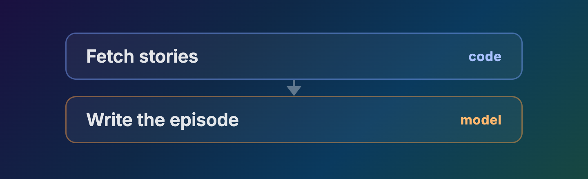
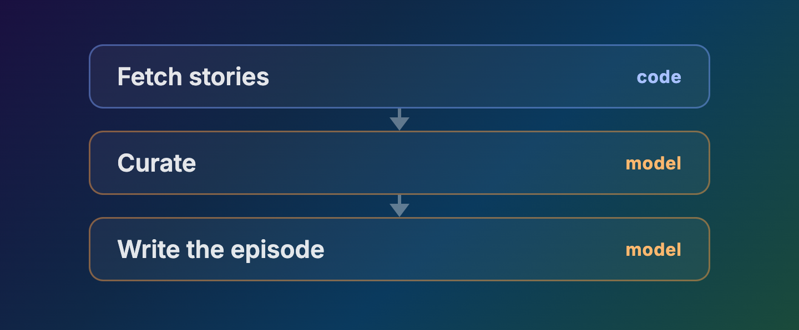
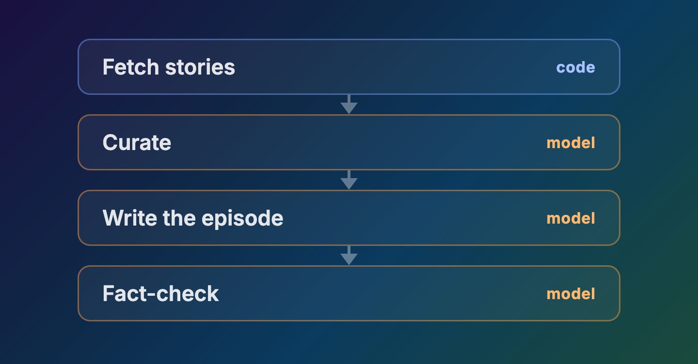
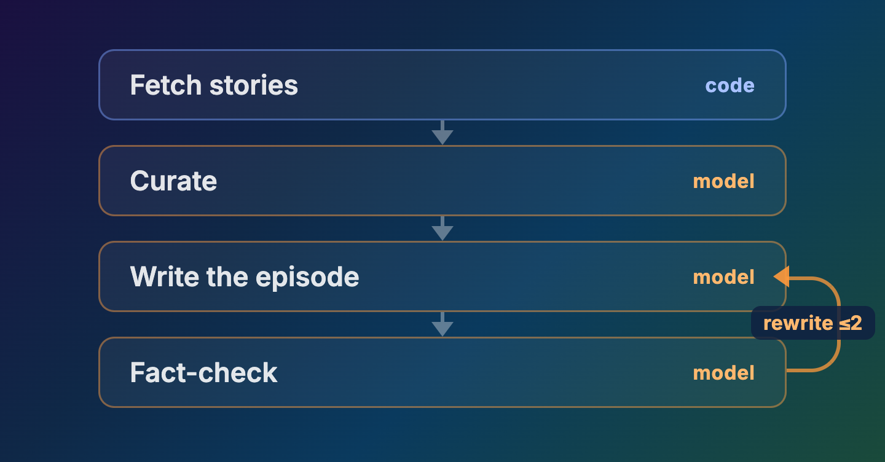
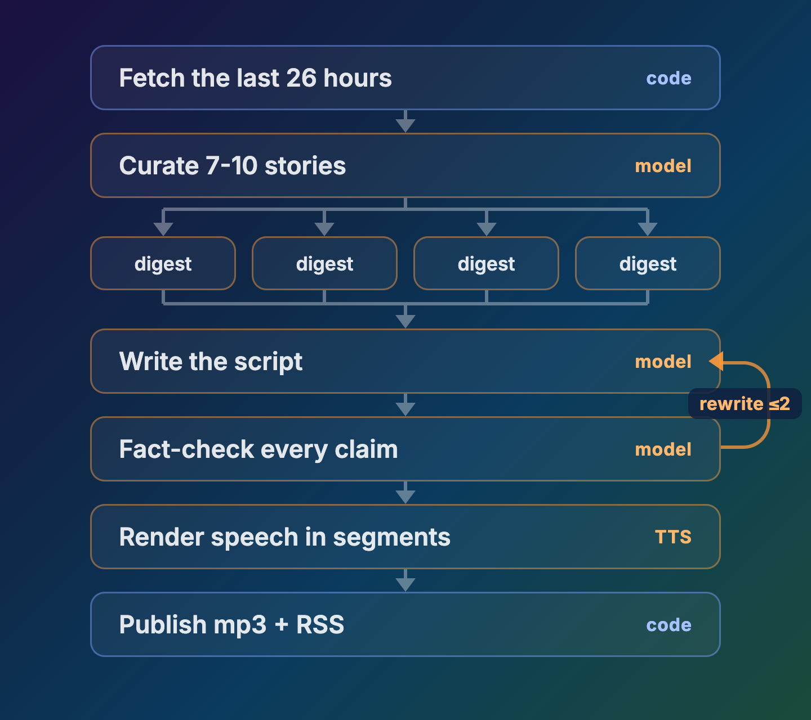
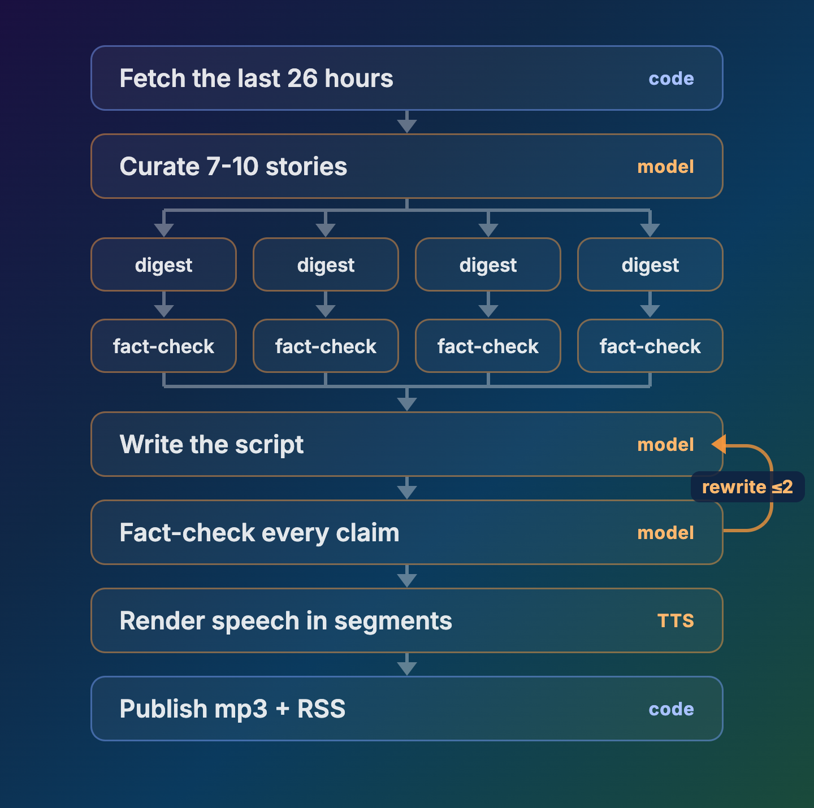
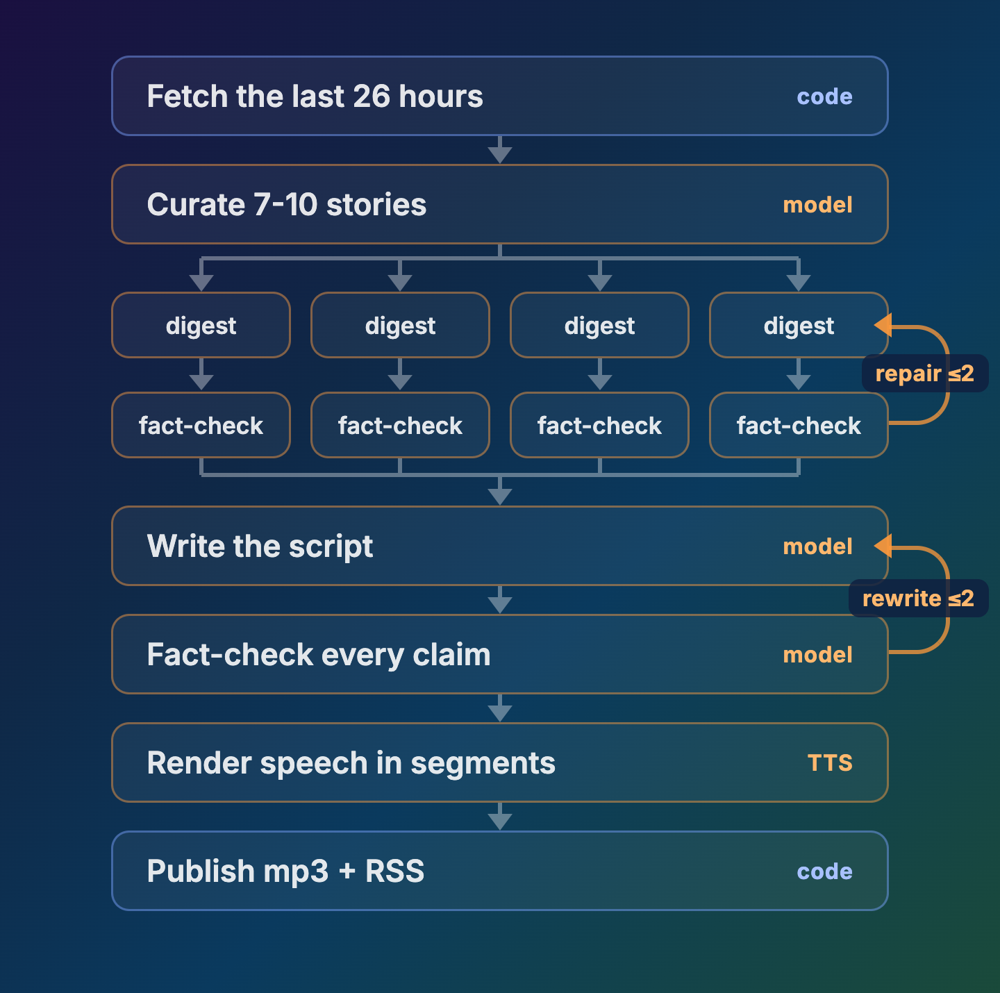

# Turning Hacker News into a daily podcast with ADK 2, Gemini TTS, and Cloud Run jobs

*A NotebookLM-style show that fact-checks every claim against its sources*

I like reading Hacker News, but there is always a lot going on. I wanted a way to catch up quickly: a short daily podcast summarizing the past day's top stories in a friendly two-host style, like NotebookLM, with fact-checking loops so that I know I can trust what I'm hearing.

So I built one. It's an [open source system](hn-daily-podcast-code/) that runs a Cloud Run job every morning: it reads the last 26 hours of Hacker News, picks the stories worth talking about, writes a two-host script, fact-checks it against the actual articles and comment threads, renders the audio, and publishes an episode to a podcast feed. Here is [a real episode](https://ykdojo.github.io/awesome-agents-on-google-cloud/hn-podcast-demo/), generated end to end through the system.

## The stack

- **Data**: the [Algolia HN API](https://hn.algolia.com/api). No key, 10,000 requests/hour, and `items/<id>` returns a story's full comment tree in one call. Article text is fetched with plain HTTP, with a few fallbacks in case that does not work.
- **Orchestration**: an [ADK 2 graph workflow](https://adk.dev/graphs/) in a Cloud Run job, triggered by Cloud Scheduler.
- **Models**: `gemini-3.1-pro-preview` and `gemini-3.6-flash` together for generating the episode, `gemini-3.1-flash-tts-preview` for voice.
- **Publishing**: a public Cloud Storage bucket with the mp3s and a generated `feed.xml`.

Versions at time of writing: `google-adk 2.6.2`, `google-genai 2.17.0`.

## The graph

The pipeline is an [ADK 2 graph workflow](https://adk.dev/graphs/). The nice thing about it is that you can describe a multi-step workflow as a graph, and the structure, including the ordering, branching, and loops, stays deterministic code no matter how many model calls happen inside the nodes. To demonstrate how it works, let's build this system from the ground up, step by step. The complete code is [here](hn-daily-podcast-code/).

The simplest version feeds sources to a model and writes an episode in one shot:

```python
workflow = Workflow(
    name="hn_digest",
    edges=[("START", fetch_stories, write_episode)],
)
```



This declares a two-step sequence: get the raw material, then turn it into a script. `fetch_stories` is a plain Python function that pulls the day's top stories from the Hacker News API. `write_episode` is an agent, a model call with instructions, which turns those stories into a two-host script. A tuple chain is a sequence, and each node's return value becomes the next node's input.

What if we want to curate which stories make the show? Separation of concerns: give curation its own node.

```python
edges=[("START", fetch_stories, curate, write_episode)]
```



Same chain, one more link: fetched stories now pass through a curation step, which picks the handful worth talking about, and only those flow on to the writer.

The way curation works: the curator gets the story metadata as JSON (titles, points, comment counts) and a prompt asking it to pick 7 to 10 stories for the episode, a few as main segments and the rest as quick mentions, optimizing for variety and how interesting they are to talk about. Its output is forced into a structured list of picks, and downstream nodes process only those stories.

What about fact-checking? One more node.

```python
edges=[("START", fetch_stories, curate, write_episode, fact_check)]
```



Now the finished script gets checked against the sources it came from. The checker extracts the claims from the script, then for each claim it returns a structured verdict, verified or failed, with a note explaining why. Those verdicts are the raw material for the next step.

But a single pass only finds problems. To fix them, add a router that can send the script back:

```python
edges=[
    ("START", fetch_stories, curate, write_episode, fact_check, review),
    (review, {"REWRITE": write_episode, "PASS": publish}),
]
```



`review` is a small plain function, not a model. It looks at the verdicts from `fact_check`. If any claim failed, it returns the route `"REWRITE"`, and the dict in the edges sends the script back to `write_episode` together with the failure notes. If everything passed, it returns `"PASS"` and the episode moves on to publishing. `review` also counts the rewrites, and after two it stops sending the script back.

That is already most of the show. The production graph adds per-story work that runs in parallel, and a bounded cut path for claims that keep failing:

```python
workflow = Workflow(
    name="hn_digest",
    edges=[
        ("START", fetch_candidates, curate, digest_stories, write_script,
         fact_check, review_router),
        (review_router, {"REWRITE": write_script,
                         "CUT": cut_failed,
                         "RENDER": render_tts}),
        (cut_failed, fact_check),
        (render_tts, publish),
    ],
)
```

Two things are new here. `digest_stories` processes every chosen story in parallel before the script is written, and the `CUT` route is a bounded fallback: claims that keep failing get removed from the script rather than looping forever.

How does the parallel part work? The edges you declare are fixed, but the number of stories changes every day, so the per-story lanes cannot be drawn as edges. Instead, ADK lets a node run other nodes dynamically. `digest_stories` asks ADK to run one digest per story, all at the same time, and waits for the results:

```python
@node(rerun_on_resume=True)
async def digest_stories(ctx: Context, node_input: dict) -> dict:
    results = await asyncio.gather(*[digest_story(p) for p in node_input["picks"]])
```

`digest_story` handles a single story. `ctx` is the workflow context that every node receives, and `ctx.run_node` runs another node as a child of this one. The `gather` runs all of them concurrently, however many the curator picked.

The fact-checking design went through a few versions. Version one fact-checked only the finished script:



Version two adds a fact-check stage inside each story's lane, auditing the digest against that story's own article and comments before the script exists:



I ran both on the same day's stories, and version two won. Both versions end with every claim verified, because failed claims either get fixed in a rewrite or removed by the cut path, but version two caught problems earlier. The audits repaired 6 of the 10 story digests before the script was written, and the script then needed one rewrite instead of two. The resulting episode also grounded what it said in attributed verbatim quotes, where the first version leaned on vague summaries.

Version three closes the symmetry: the per-story check loops the same way the script-level check does, with failed audits sent back for repair, capped at two rounds:



## Turning the script into speech

The script renders in segments of roughly 90 seconds, one TTS call per segment, and code concatenates the audio with a beat of silence between segments. A single call for the whole episode goes through, but it does not really work: the audio quality degrades after the first few minutes. Each segment call looks like this:

```python
interaction = client.interactions.create(
    model="gemini-3.1-flash-tts-preview",
    input=TTS_STYLE + transcript,
    response_format={"type": "audio"},
    generation_config={"speech_config": [
        {"speaker": "Hacker", "voice": "Despina"},
        {"speaker": "News", "voice": "Charon"},
    ]},
)
```

The hosts are openly robots named Hacker and News, and the show opens with the disclosure as a gag: "Good morning. I'm Hacker." / "And I'm News." Multi-speaker Gemini TTS is the API Google positions for exactly this NotebookLM-style podcast audio, and unlike NotebookLM's Audio Overviews, everything upstream of the voices is yours to control.

## Running it every morning

Cloud Run jobs are run-to-completion containers: start, run the graph once, exit, pay for nothing in between. Scheduling is one command pair:

```bash
gcloud run jobs create hn-digest --image $IMAGE --task-timeout 3600 ...
gcloud scheduler jobs create http hn-digest-morning \
  --schedule="0 6 * * *" --time-zone="America/Los_Angeles" \
  --uri="https://run.googleapis.com/v2/projects/$PROJECT/locations/$REGION/jobs/hn-digest:run" \
  --oauth-service-account-email=$SERVICE_ACCOUNT
```

The first command deploys the pipeline as a job, and the second tells Cloud Scheduler to trigger it every morning at six.

## Publishing an actual podcast

The publish node uploads the mp3 and regenerates `feed.xml`: RSS 2.0 with the iTunes namespace tags - cover art and category for the show, and for each episode a link to its mp3, an ID, a date, and a duration. That file on a public bucket is a complete podcast. Paste the feed URL into any podcast app that can add a show by URL, like Pocket Casts, Overcast, or Apple Podcasts with its "Follow a Show by URL" option, and it subscribes.

Directory listing is separate: submit the feed once to Apple Podcasts Connect and Spotify for Creators, and since most smaller apps read Apple's directory, those two cover nearly everyone.

## The code

The full source for the pipeline, everything from fetching stories to publishing the feed, is available [here](hn-daily-podcast-code/).
